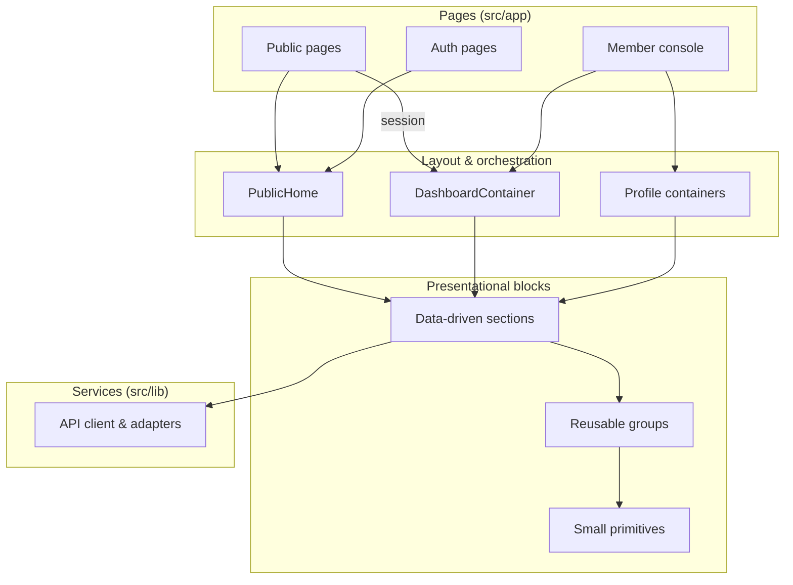
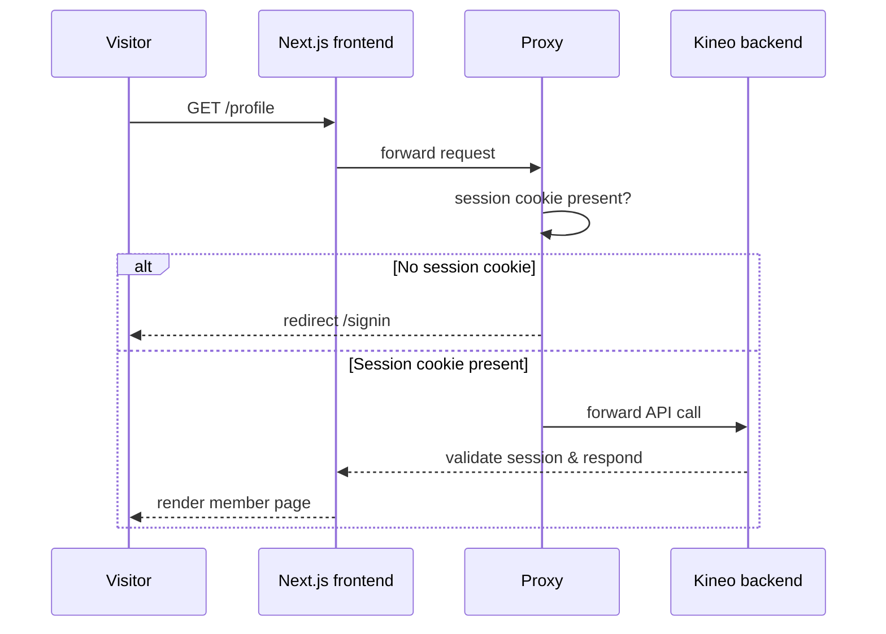

# Kineo — Frontend

> Web frontend for **Kineo**, a modern platform dedicated to medical locum work in France.

Kineo connects **established practitioners** with **locum doctors**. Publish a cover
opening in minutes, receive verified applications, and follow every application to the day of
the locum assignment — on both sides of the table.

---

## Features

**For established practitioners**

- Publish a locum opening in ~2 minutes: dates, retrocession, expectations.
- Receive applications from RPPS-verified locums and choose the right match.

**For locum doctors**

- Browse open openings near you; review dates and retrocession at a glance.
- Apply in one click with a personalized message.

**Shared**

- Real-time status tracking on every application — sent, viewed, accepted, refused.
- Verified identities (RPPS) checked before activation.
- Free during beta, no commitment.

**Member console**

- Personal dashboard: quick actions, key stats, application feed and reactivity panel.
- Full profile management: create & edit your professional profile, account
  information, email change, avatar, and account deletion.

---

## Tech stack

| Area     | Choice                |
|----------|-----------------------|
| Framework| Next.js 16 (App Router)|
| Language | TypeScript 5          |
| Runtime  | React 19              |
| Styling  | Tailwind CSS 4        |
| Map      | MapLibre GL (OSM raster) |
| Auth     | Better-Auth (session) |
| Tooling  | bun · Biome           |

---

## Getting started

Prerequisites: [bun](https://bun.sh), a Node-compatible runtime, and a running instance of
the Kineo backend (`kineo-nest-backend`).

Copy `.env.example` to `.env` and configure the backend / base-URL variables.

```bash
bun install        # install dependencies
bun run dev        # start the dev server (port 3001)
bun run build      # production build (type-check + compile)
bun run start      # serve the production build
bun run lint       # lint & format check (Biome)
bun run format     # auto-format code (Biome)
bun run test       # unit tests for src/lib (bun test)
```

### Scripts

| Command           | Description                             |
|-------------------|-----------------------------------------|
| `bun run dev`     | Development server (port 3001)          |
| `bun run build`   | Production build (type-check + compile) |
| `bun run start`   | Serve the production build              |
| `bun run lint`    | Lint & format check (Biome)             |
| `bun run format`  | Auto-format code (Biome)                |
| `bun run test`    | Unit tests for `src/lib` (bun test)     |

---

## Routes

| Path                  | Purpose                                    |
|-----------------------|--------------------------------------------|
| `/`                   | Home — member dashboard or marketing page  |
| `/signin` · `/signup` | Authentication                             |
| `/forgot-password` · `/reset-password` | Password recovery        |
| `/verify-email`       | Email verification                        |
| `/profile` (`/create`, `/edit`) | Member profile management          |
| `/applications` (+ `/{id}`) | Application tracking (locum side)    |
| `/listings`          | Browse open postings — filters + map (public) |
| `/listings/mine`     | Published listings + received candidates |
| `/goodbye`           | Account-erasure confirmation (from the email link) |
| `/terms` · `/privacy` | Legal documents                       |

Protected routes are guarded by an optimistic session-cookie check in `src/proxy.ts`
that redirects guests to `/signin`. The guard covers `/profile`, `/applications`,
`/listings/mine` and `/practices`; the first three exist, `/practices` does not yet.
Every guarded page also resolves the session for real on the server and redirects an
`anonymous` state itself, so the cookie check is a fast path rather than the only
barrier.

`/listings` — the browse feed — is deliberately outside that guard, and is the one
listing route that is public. It is the page a replacement doctor lands on to find
work, and `GET /replacement-listings` is anonymous on the backend: redirecting a
signed-out reader away would hide the openings from the people who most need to
see that there are any. The practice side of the same URL prefix keeps the guard.

---

## Project structure

```text
src/
├── app/              # Routes (App Router) — thin page shells
│   ├── (site)/       # Routes behind the shared site layout
│   │   ├── page.tsx  # Home: member dashboard or marketing content
│   │   ├── applications/  # Application tracking (locum side)
│   │   ├── listings/mine/ # Published listings (practice side)
│   │   ├── profile/  # Profile management
│   │   ├── privacy/ terms/
│   │   └── loading.tsx   # Streaming fallback for the site shell
│   ├── signin/ signup/ goodbye/
│   ├── forgot-password/ reset-password/
│   ├── verify-email/
│   └── api/          # Same-origin proxy to the backend
│       ├── [...path]/route.ts      # Data routes
│       └── auth/[...all]/route.ts  # Auth routes
│       └── → both delegate to lib/backend-proxy.ts
├── components/       # Reusable presentational blocks
│   ├── atoms/ molecules/ organisms/ templates/
└── lib/              # Services & shared logic
    ├── dashboard/    # Dashboard service + presentation contracts
    ├── listings/     # Listings service + presentation contracts
    ├── applications/ # Applications service + presentation contracts
    ├── api-client.ts # Typed fetch + errors; transport is injected
    ├── api-errors.ts # The one place a failure becomes a French sentence
    ├── types/        # Raw API types (hand-written; see the note below)
    └── …             # Auth client, marketing content, navigation, formatting
└── proxy.ts          # Next 16 proxy: optimistic auth guard
```

A page never fetches for itself: it resolves the session and the data on the server
and hands a client container the result. The domain services are isomorphic — the
caller passes an `ApiTransport`, which is `browserTransport` in the browser and
`serverTransport` on the server (`lib/api-transport.server.ts`). That is what lets the
same service functions serve both, with no `typeof window` check anywhere.

---

## Architecture

The frontend is organized around a **page shell → presentational blocks → service layer**
separation. Pages are thin shells that delegate to layout and orchestration containers,
and reusable presentational blocks are assembled from small, focused primitives.



### Server-rendered by default

Every data screen resolves its data on the server. The home page decides between the
member dashboard and the marketing content from the session, and the dashboard itself
streams behind a Suspense boundary, so the shell paints immediately and no screen
opens with a loading skeleton that a server render would have replaced.

What is left as client components: the header (session-aware links), the auth and
erasure forms, the containers that own post-mutation state, and `Reveal` — the
scroll-reveal wrapper on the marketing sections, which needs an IntersectionObserver.
Everything else in the anonymous landing page ships as server-rendered HTML.

### Service layer

Components never talk to the backend directly. A service layer (`src/lib`) fetches
data through a shared API client, adapts raw responses into presentation contracts,
and owns the French wording for anything domain-shaped (status labels, retention
copy, editorial content). Copy that belongs to a single screen rather than to a domain
— button labels, form hints — still lives in the component that renders it.

`lib/api-errors.ts` is the one place a failure becomes a sentence. Screens branch on
an `ErrorKind` derived from the typed status the API client already extracted, and a
domain that has better wording passes an override. Nothing classifies a failure by
matching on the text of an error message.

`lib/types/api.ts` is hand-written, not generated: `templates/api.json` documents the
request DTOs only, so every response shape there was transcribed from real backend
output. A field the backend adds will not appear until someone reads it off a
response — treat a missing field as unknown rather than absent.

---

## Authentication

Authentication relies on **Better-Auth** sessions. The Next proxy performs an
optimistic session-cookie check on protected routes and redirects guests to the
sign-in page; real validation happens in the backend on every API call.

Each protected page resolves the session itself as well (`lib/server-auth.ts`,
cached per request, so the layout and the page share one read). That is the
authoritative check: the cookie test only skips a round trip for a guest who has no
cookie at all.



---

## Performance

- Data resolved on the server: no client fetch waterfall and no skeleton on a cold load.
- Streaming shell on the dynamic home route for instant perceived load.
- Fonts via `next/font` — downloaded at build time and served from this origin, so
  no request leaves the site at runtime.
- Inline SVG icons — no bitmap assets.

---

## Roadmap

The platform is evolving beyond the core user journey. Priorities below, in rough order:

### Phase 1 — Core product experience
- **Live listings** — publish & browse openings (`/listings`, `/practices`), with
  filters by speciality, dates and location. `/listings` now exists: the public
  feed, with filters, a map and per-specialty counts from
  `GET /replacement-listings/facets`. `/listings/mine` (the practice's own
  listings) is in place; `/practices` does not yet, so that nav link still 404s.
  - The feed's *sort* control orders the rows on screen only — the endpoint
    exposes no sort parameter. Sorting the whole collection is backend work.
- **Apply to a listing** — `/applications` tracks the applications already sent,
  but there is no browse-and-apply flow yet, and no public listing detail page
  for a row to open.
- **Pricing page** — fill the last placeholder link in the product navigation.

### Phase 2 — Trust & network effects
- **Verified profile depth** — richer RPPS-backed credentials, speciality and
  experience badges shown to both sides.
- **Reactivity & response-time signals** — surface average response times to
  encourage faster, more reliable matching.

### Phase 3 — Reliability & scale
- **Tests and CI** — `src/lib` has unit tests (`bun run test`, bun's runner, no
  extra dependency) but there is no CI and the API client's error parsing and the
  GDPR erasure flow are still unverified; the adapters the browse feed depends on
  are now covered.
- **Component tests** — the screen logic that is *not* in `src/lib` (the map's
  WebGL lifecycle above all) is covered by nothing but manual exercise.
- **A generated API contract** — derive the response types from the OpenAPI
  document rather than transcribing them, so a backend field change surfaces as a
  type error.
- **Web Vitals monitoring** — instrument and report core performance metrics.
- **Design-system consolidation** — unify component naming and surface styles
  across pages.

### Not decided yet
- Notifications (email / push) and calendar sync for openings.
- Feedback & ratings between practitioners after a completed assignment.